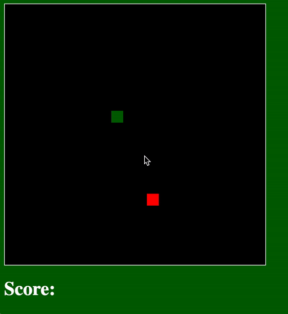

# Snake
Building Snake from scratch in Advanced Software Development.  

**Table of Contents**
- [Setup](#setup)
- [Skills Practiced](#skills-practiced)
- [Worksheet](#worksheet)
- [Requirements](#requirements)
- [Grade Rubric and Schedule](#grade-rubric-and-schedule)

<a href="https://benspector3.github.io/projects/snake/index.html" target="_blank"> Play the demo! (Right Click --> Open in new tab) </a>



# Setup

To install this project, first clone the [template](https://github.com/OperationSpark/asd-template) repository, then move and rename the folder by entering these commands into your bash terminal:

```bash
git clone https://github.com/OperationSpark/asd-template
rm -rf asd-template/.git
mv asd-template asd-projects/snake
```

# Skills Practiced
- Separation of Concerns and Abstraction
- Keeping code organized between `initialization`, `core logic`, `helper functions` and `event handler` sections
- Controlling DOM elements with jQuery
- Managing data for DOM elements with Objects and Factory Function
- Managing a collection of Objects with an Array
- Iteration
- Initializing new DOM elements with jQuery

# Worksheet

Before beginning, complete the <a href="https://drive.google.com/open?id=1h9DBLktvwVCODaAn4vg5FKnbkbyYjLIMik5IMYMbhY0" target="_blank"> Snake Worksheet </a>


# Requirements

## The Board
**1) Think of the board as a 2-D grid of 20 pixel * 20 pixel squares.** 

For example If the board is `440` pixels wide and `440` pixels tall:
  - 22 columns along the x-axis
  - 22 rows along the y-axis
  
**2) Game items (the apple, each piece of the snake) must be positioned in intervals of 20 pixels.** 

For example, consider the conversions below:
```
snakeHeadColumn = 5;
snakeHeadX = 20 * snakeHeadColumn = 100

snakeHeadRow = 10;
snakeHeadY = 20 * snakeHeadRow = 200
```

## The Snake

**1) Each component of the snake must be an `{ Object }`**

**2) The entire snake's body must be represented as an `[Array]` of these `{Object}`s**
  - The first object in the Array is the "head" of the snake

**3) When the snake collides with the apple:**
  - A new DOM element is created and added to the board using jQuery.
  - A new snake `{Object}` is created and added to the snake `[Array]`
  
**4) The snake's head must continously move in 20 pixel intervals**
  - The head can move along either the x-axis (horizontally) or the y-axis (vertically), but never both (diagonally)
  - The user controls when the snake's head changes direction
  - The 2nd snake object follow the head, the 3rd follows the 2nd, etc… 

## The Apple
**1) The apple must be an `{Object}`**

**2) The apple's location is determined randomly and must be in an unoccupied, valid position.**
- valid: the apple's x/y coordinate must be a multiple of 20
- unoccupied: any part of the snake cannot already be there

**3) Each time the snake collides with the apple, the apple is moved to a new, random, unoccupied, and valid location**

**4) The number of apples eaten must be displayed**

# Grade Rubric and Schedule

## Best Practices (30 points)

1. All code in proper sections (setup, core, helpers, etc.) - 5 points
2. Use objects to store data - 5 points
3. Use comments to describe setup and functions - 5 points
4. Use factory functions - 5 points
5. Use helper functions to separate concerns - 5 points
6. Generalize functions (i.e. only one collision detection function, not including wall collisions) - 5 points

## Program Content (70 points)

### Week 1

1. Get the snake head and apple to appear on screen - 5 points
2. Set framerate to 10 - 0 points
3. Get the snake to move continuously - 5 points
4. Change directions with arrow or WASD keys - 5 points

### Week 2

1. Prevent the snake from reversing with a single input - 5 points
2. Detect wall collisions (and end game on collision) - 5 points
3. Make the score appear on screen - 5 points
4. Bonus - Prevent the snake from reversing even with multiple inputs per frame - 5 points

### Week 3

1. Detect snake-apple collisions - 5 points
2. Move the apple randomly on collision (must not be able to reappear on snake) - 5 points
3. Create proper CSS for snake body class - 5 points
4. Create working function to add new snake pieces - 10 points
5. Increase score and add new snake piece on apple collision - 5 points

### Week 4

1. Have the snake's body follow the head - 5 points
2. Check for head collision with the body (and end game on collision) - 5 points
